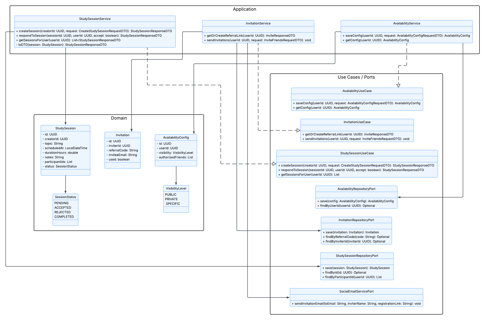
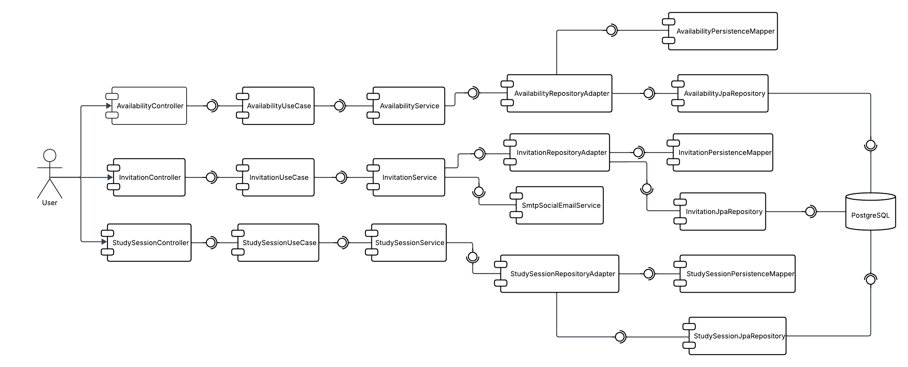
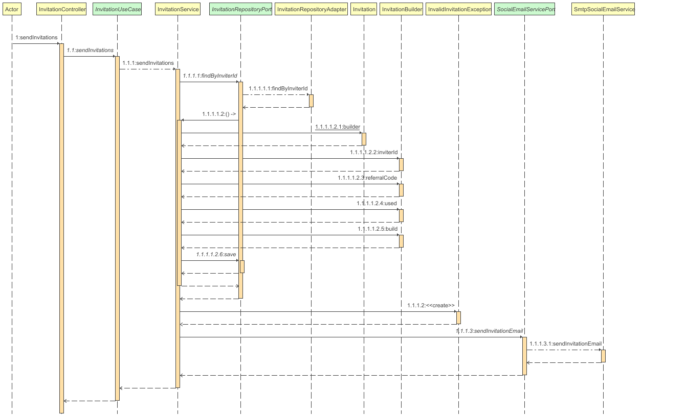
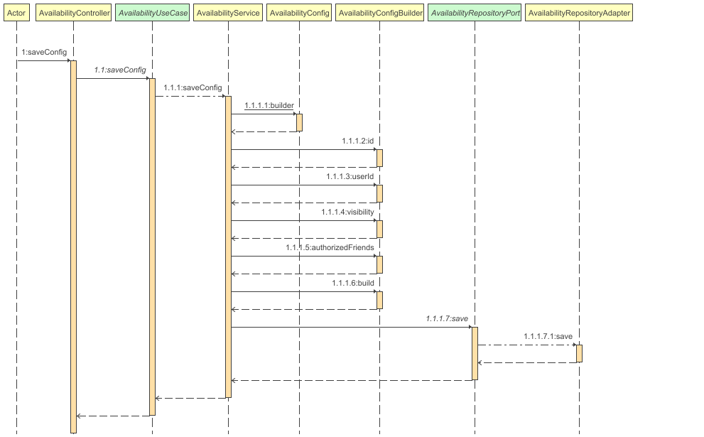
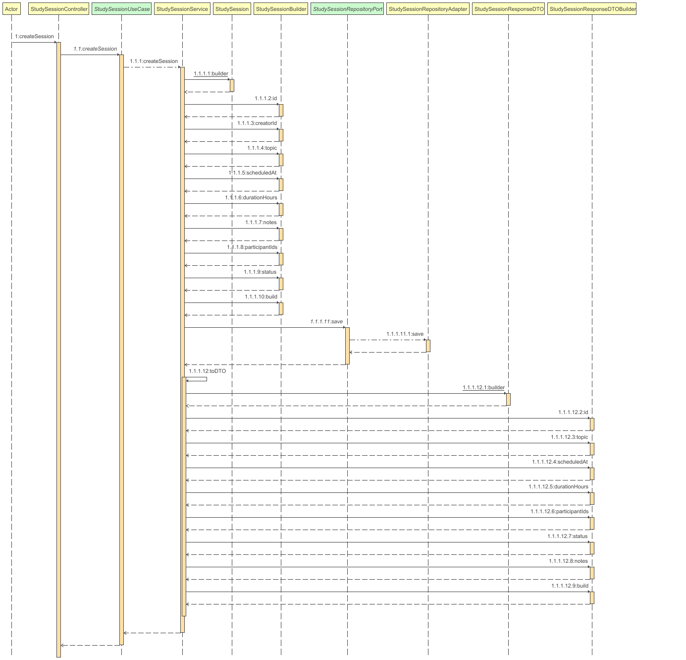

<div align="center">

# 🤝 AIBERT — Social Service

### *"Fomentando la colaboración y el estudio en grupo entre estudiantes"*

---

### 🛠️ Stack Tecnológico


### ☁️ Infraestructura & Calidad


### 🏗️ Arquitectura


</div>

---

## 📑 Tabla de Contenidos

1. [👤 Integrantes](#1--integrantes)
2. [🎯 Objetivo del Microservicio](#2--objetivo-del-microservicio)
3. [⚡ Funcionalidades Principales](#3--funcionalidades-principales)
4. [📋 Estrategia de Versionamiento y Branches](#4--manejo-de-estrategia-de-versionamiento-y-branches)
5. [⚙️ Tecnologías Utilizadas](#5--tecnologias-utilizadas)
6. [🧩 Funcionalidad](#6--funcionalidad)
7. [📊 Diagramas](#7--diagramas)
8. [⚠️ Manejo de Errores](#8--manejo-de-errores)
9. [🧪 Evidencia de Pruebas y Ejecución](#9--evidencia-de-las-pruebas-y-como-ejecutarlas)
10. [🗂️ Organización del Código](#10--codigo-de-la-implementacion-organizado-en-las-respectivas-carpetas)
11. [🚀 Ejecución del Proyecto](#11--ejecucion-del-proyecto)
12. [☁️ CI/CD y Despliegue en Azure](#12--evidencia-de-cicd-y-despliegue-en-azure)
13. [🤝 Contribuciones](#13--contribuciones)

---

## 1. 👤 Integrantes

- **Equipo:** Grootyology

---

## 2. 🎯 Objetivo del microservicio

El **Social Service** tiene como objetivo gestionar las funcionalidades sociales de la plataforma AIBERT, permitiendo a los estudiantes **conectar entre sí, coordinar sesiones de estudio y compartir disponibilidad académica**.

Este microservicio busca fortalecer el aprendizaje colaborativo y la interacción entre estudiantes, complementando los módulos de planificación, recomendaciones y gamificación.

---

## 3. ⚡ Funcionalidades principales

<div align="center">

<table>
  <thead>
    <tr>
      <th>🧩 Funcionalidad</th>
      <th>Descripción</th>
    </tr>
  </thead>
  <tbody>
    <tr>
      <td><strong>Invitación de Amigos</strong></td>
      <td>Permite enviar y gestionar invitaciones de amistad entre usuarios.</td>
    </tr>
    <tr>
      <td><strong>Compartir Disponibilidad</strong></td>
      <td>Permite compartir horarios disponibles para coordinar sesiones de estudio.</td>
    </tr>
    <tr>
      <td><strong>Sesiones de Estudio Compartidas</strong></td>
      <td>Gestiona la creación y participación en sesiones de estudio colaborativas.</td>
    </tr>
  </tbody>
</table>

</div>

---

## 4. 📋 Manejo de Estrategia de versionamiento y branches

Para el desarrollo del **Social Service** se utiliza una estrategia de control de versiones basada en **Git Flow**, la cual permite organizar el trabajo del equipo y mantener una separación clara entre el desarrollo de funcionalidades sociales y las versiones estables del microservicio.

Esta estrategia ha facilitado la implementación progresiva de funcionalidades relacionadas con la interacción entre usuarios, tales como invitaciones de amistad, gestión de disponibilidad y sesiones de estudio colaborativas, así como ajustes técnicos realizados durante la evolución del módulo social.

### Estrategia de Ramas (Git Flow)

El repositorio maneja principalmente las siguientes ramas:

- `main`
- `develop`
- `feature/*`

El trabajo diario se ha concentrado en ramas `feature/*`, permitiendo desarrollar funcionalidades sociales de forma aislada y reducir conflictos durante la integración.

### Ramas y propósito

#### `main`
- Contiene la versión estable del **Social Service**.
- Se utiliza como referencia para despliegues y demostraciones del módulo social.
- No se realizan desarrollos directos sobre esta rama.
- Los cambios llegan a `main` únicamente después de haber sido integrados y validados en `develop`.

#### `develop`
- Rama utilizada para integrar las funcionalidades sociales en desarrollo.
- Sirve como base para crear nuevas ramas `feature/*`.
- Permite validar de forma conjunta los cambios relacionados con invitaciones, disponibilidad y sesiones de estudio antes de considerarlos estables.

#### `feature/*`
- Ramas destinadas al desarrollo de funcionalidades específicas y tareas técnicas del microservicio social.
- Se crean a partir de `develop` y se integran nuevamente mediante Pull Requests.
- Ejemplos de ramas utilizadas durante el desarrollo del Social Service:
    - `feature/dockerizacion`: contenedorización del microservicio para facilitar su despliegue.
    - `feature/social`: implementación y ajustes de las funcionalidades sociales.

Este enfoque permitió trabajar cada funcionalidad social de forma independiente, facilitando su revisión y evitando interferencias entre cambios simultáneos.

### Flujo de trabajo general

1. Se crea una rama `feature/*` a partir de `develop`.
2. Se implementan los cambios asociados a una funcionalidad social específica.
3. Se validan los cambios de forma local.
4. Se genera un Pull Request hacia `develop`.
5. Una vez consolidadas las funcionalidades, `develop` se integra en `main` para actualizar la versión estable del microservicio.

Este flujo ha permitido mantener un desarrollo ordenado, controlado y consistente a lo largo del ciclo de vida del **Social Service**.

---

## 5. ⚙️ Tecnologías Utilizadas

| Tecnología | Uso principal |
|----------|---------------|
| **Java 21** | Lenguaje base del microservicio |
| **Spring Boot** | Exposición de APIs REST |
| **Spring Data JPA** | Acceso y persistencia de datos sociales |
| **PostgreSQL** | Base de datos relacional |
| **Maven** | Gestión de dependencias |
| **Docker** | Contenerización |
| **GitHub Actions** | Integración continua |

---

## 6. 🧩 Funcionalidad

### 📨 Invitación de Amigos

Permite enviar y gestionar solicitudes de amistad entre usuarios dentro de la plataforma AIBERT, facilitando la conexión entre estudiantes para actividades colaborativas.

**Endpoint principal:**  
`POST /api/social/invite`

---

### 📦 Estructura de la Solicitud (Request)

| Campo | Tipo | Restricción | Descripción |
|-----|------|-------------|-------------|
| senderId | UUID | Obligatorio | Identificador del usuario que envía la invitación |
| receiverId | UUID | Obligatorio | Identificador del usuario que recibe la invitación |

---

### 📦 Estructura de la Respuesta (Response)

| Campo | Tipo | Descripción |
|-----|------|-------------|
| message | String | Confirmación del envío de la invitación |
| status | String | Estado de la solicitud de amistad |

---

### 📅 Compartir Disponibilidad

Permite registrar y consultar la disponibilidad horaria del usuario para coordinar sesiones de estudio colaborativas.

**Endpoint principal:**  
`PUT /api/social/availability`

---

### 📦 Estructura de la Solicitud (Request)

| Campo | Tipo | Restricción | Descripción |
|-----|------|-------------|-------------|
| userId | UUID | Obligatorio | Identificador del usuario |
| availability | List<String> | Obligatorio | Horarios disponibles del usuario |

---

### 📦 Estructura de la Respuesta (Response)

| Campo | Tipo | Descripción |
|-----|------|-------------|
| message | String | Confirmación de actualización de disponibilidad |

---

### 👥 Sesión de Estudio Compartida

Permite crear y participar en sesiones de estudio colaborativas entre varios usuarios.

**Endpoint principal:**  
`POST /api/social/study-session`

---

### 📦 Estructura de la Solicitud (Request)

| Campo | Tipo | Restricción | Descripción |
|-----|------|-------------|-------------|
| creatorId | UUID | Obligatorio | Usuario que crea la sesión |
| participants | List<UUID> | Obligatorio | Usuarios invitados a la sesión |
| scheduledAt | LocalDateTime | Obligatorio | Fecha y hora de la sesión |

---

### 📦 Estructura de la Respuesta (Response)

| Campo | Tipo | Descripción |
|-----|------|-------------|
| sessionId | UUID | Identificador de la sesión creada |
| message | String | Confirmación de creación de la sesión |

---

## 7. 📊 Diagramas

---


### 🧱 Diagrama de Clases — Social Service

El diagrama de clases muestra la estructura interna del microservicio y cómo se modelan las interacciones sociales entre usuarios siguiendo una arquitectura hexagonal dividida en capas de Entrypoints, Application, Domain e Infrastructure. Se observa cómo los controladores `InvitationController`, `AvailabilityController` y `StudySessionController` delegan la lógica a los casos de uso correspondientes, el manejo de entidades de dominio como `Invitation`, `AvailabilityConfig` y `StudySession`, así como la persistencia y servicios externos a través de puertos y adaptadores desacoplados de la lógica de negocio.

<div align="center">



</div>

---

### 🧩 Diagrama de Componentes — Social Service

El diagrama de componentes muestra la interacción entre los principales componentes del **Social Service** durante la gestión de funcionalidades sociales. Se observa cómo los controladores `InvitationController`, `AvailabilityController` y `StudySessionController` delegan la lógica a los casos de uso correspondientes, los cuales interactúan con los repositorios a través de puertos y adaptadores para persistir invitaciones, configuraciones de disponibilidad y sesiones de estudio, manteniendo desacoplada la lógica de negocio.

<div align="center">



</div>

---

### 🔁 Diagrama de Secuencia — Envío de Invitaciones

Este diagrama de secuencia representa el flujo completo de envío de invitaciones entre usuarios dentro del microservicio social. El proceso inicia cuando el usuario solicita enviar una invitación, el `InvitationController` delega la operación al `InvitationUseCase`, se valida y persiste la invitación y, cuando corresponde, se notifica al usuario invitado antes de retornar la confirmación.

<div align="center">



</div>

---

### 🔁 Diagrama de Secuencia — Guardar Configuración de Disponibilidad

Este diagrama de secuencia describe el proceso de registro y actualización de la disponibilidad horaria del usuario. El flujo muestra cómo el `AvailabilityController` recibe la configuración enviada, el caso de uso construye el objeto de dominio `AvailabilityConfig` y la información es persistida mediante el repositorio antes de finalizar la operación.

<div align="center">



</div>

---

### 🔁 Diagrama de Secuencia — Creación de Sesión de Estudio

Este diagrama de secuencia muestra el flujo de creación de una sesión de estudio compartida. El proceso inicia cuando el usuario solicita crear la sesión, el `StudySessionController` delega la lógica al `StudySessionUseCase`, se construye la entidad `StudySession`, se persiste la información y se retorna la confirmación de la sesión creada.

<div align="center">



</div>

---

## 8. ⚠️ Manejo de Errores

El **Social Service** implementa un mecanismo centralizado de manejo de errores con el fin de garantizar respuestas claras y consistentes durante las operaciones sociales del sistema, como el envío de invitaciones, la configuración de disponibilidad y la creación de sesiones de estudio compartidas.

A través de un manejador global de excepciones, se interceptan errores tanto de validación como del dominio de negocio, evitando exponer información interna del sistema y manteniendo un formato de respuesta uniforme para el cliente.

Este enfoque permite que el frontend y los demás microservicios puedan manejar los errores de forma predecible y desacoplada de la implementación interna del servicio.

---

### 📊 Tipos de errores manejados

| Código HTTP | Escenario |
|------------|-----------|
| **400 Bad Request** | Datos inválidos en la petición relacionada con invitaciones, disponibilidad o sesiones de estudio. |
| **404 Not Found** | Usuario, invitación, configuración o sesión social no encontrada. |
| **500 Internal Server Error** | Error inesperado durante la gestión de funcionalidades sociales. |

---

Cuando ocurre un error, el servicio retorna únicamente la información necesaria para que el cliente pueda reaccionar adecuadamente, sin revelar detalles internos del sistema, reforzando así las buenas prácticas de manejo de excepciones dentro de la plataforma **AIBERT**.

---

## 9. 🧪 Evidencia de Pruebas y Ejecución

El microservicio cuenta con pruebas unitarias para los flujos principales de interacción social.

```bash
mvn clean test
```

## 10. 🗂️ Organización del Código (Scaffolding)

El microservicio sigue una arquitectura hexagonal (puertos y adaptadores):

```
social-service/
├── 📁 src
│   ├── 📁 main
│   │   ├── 📁 java
│   │   │   └── 📁 com.aibert.dosw
│   │   │       ├── 📁 application                 # 🔵 CAPA DE APLICACIÓN
│   │   │       │   ├── 📁 dto
│   │   │       │   │   ├── 📁 request              # DTOs de entrada
│   │   │       │   │   └── 📁 response             # DTOs de salida
│   │   │       │   ├── 📁 mapper                   # Mappers aplicación ↔ dominio
│   │   │       │   ├── 📁 service                  # Servicios de aplicación
│   │   │       │   └── 📁 usecase.user             # Casos de uso del módulo social
│   │   │       │
│   │   │       ├── 📁 config                       # ⚙️ CONFIGURACIONES
│   │   │       │
│   │   │       ├── 📁 domain                       # 🟢 CAPA DE DOMINIO
│   │   │       │   ├── 📁 exceptions               # Excepciones del dominio social
│   │   │       │   └── 📁 model
│   │   │       │       ├── 📁 user                 # Entidades de dominio
│   │   │       │       └── 📁 valueObjects          # Value Objects (Visibility, Status, etc.)
│   │   │       │
│   │   │       ├── 📁 ports                        # Puertos In / Out
│   │   │       │   ├── 📁 in                       # Interfaces de casos de uso
│   │   │       │   └── 📁 out                      # Interfaces de persistencia y servicios externos
│   │   │       │
│   │   │       ├── 📁 entrypoints                  # 🔴 CAPA DE ENTRADA
│   │   │       │   ├── 📁 advice                   # Manejo global de errores
│   │   │       │   └── 📁 rest
│   │   │       │       ├── 📁 controller            # Controllers REST (invites, availability, sessions)
│   │   │       │       └── 📁 mapper                # Mappers REST ↔ aplicación
│   │   │       │
│   │   │       ├── 📁 infrastructure               # 🟠 CAPA DE INFRAESTRUCTURA
│   │   │       │   ├── 📁 adapters
│   │   │       │   │   └── 📁 adapter               # Implementaciones de los puertos
│   │   │       │   └── 📁 persistence
│   │   │       │       ├── 📁 entity                # Entidades JPA
│   │   │       │       ├── 📁 mapper                # Mappers dominio ↔ persistencia
│   │   │       │       └── 📁 repository            # Repositorios JPA
│   │   │       │
│   │   │       ├── 📁 external.email                # Integración con servicios de correo
│   │   │       │
│   │   │       └── SocialServiceApplication      # Punto de arranque Spring Boot
│   │   │
│   │   └── 📁 resources                            # application.yml
│   │
│   └── 📁 test                                     # 🧪 PRUEBAS UNITARIAS
│
└── pom.xml                                      # Configuración Maven
```

---

## 11. 🚀 Ejecución del Proyecto

### 📋 Prerrequisitos
- **Java 21**
- **Maven 3.8+**
- **Docker** (Opcional)

### 🛠️ Opción 1: Ejecución Local (Maven)

```bash
mvn spring-boot:run
```
📍 **URL Local:** `http://localhost:8080` (o el puerto configurado)  
📚 **Documentación API (Swagger):** `http://localhost:8080/swagger-ui.html`

### 🐳 Opción 2: Ejecución con Docker (Si se incluye Dockerfile)

```bash
docker-compose up --build -d
```

---

## 12. ☁️ CI/CD y Despliegue en Azure

El proyecto tiene capacidad para desplegarse mediante GitHub Actions hacia Azure App Service o un entorno contenedorizado en la nube.
Se definen perfiles como `dev` y `prod` en `application.yml` para gestionar la cadena de conexión de MongoDB y las keys de Gemini/Groq.

---

## 13. 🤝 Contribuciones

### Metodología
Se utiliza **Scrum** con iteraciones cortas, asegurando entregas continuas y mejora de valor. Las ramas principales son protegidas y todos los PRs deben cumplir validación estática (SonarQube) y ejecutar pipelines de CI.

<div align="center">

### 🏆 Proyecto AIBERT


</div>